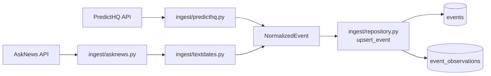

# Event extraction

Two sources feed the `events` table. They disagree about almost everything —
what a record is, how trustworthy it is, how often it changes — so they meet at
a single contract rather than talking to the database in their own shapes.



## The contract

`ingest/normalize.py` — every adapter returns `NormalizedEvent`, which
validates on construction (empty title, end before start, a latitude that is
really a longitude). An adapter cannot emit a malformed event, only fail to
build one.

Identity is `dedupe_key` = normalized title + city slug + local start date.
Category is excluded on purpose: the sources routinely disagree on it, and that
must not split one real event into two rows.

Two fields carry trust. `status` is `ACTIVE` for a confirmed listing,
`PROVISIONAL` for a PredictHQ *predicted* event or anything from prose, and
`DELETED`/`CANCELLED` once withdrawn. `date_precision` is `DAY`, `MONTH` or
`QUARTER` — coarse dates are kept as early signal rather than rounded into a
stay-night they cannot support.

## The two adapters

**PredictHQ** (`ingest/predicthq.py`) pages structured listings by
`updated.gte`. Records arrive dated and geocoded, so the adapter is mostly
field mapping: GeoJSON `[lon, lat]` unpacked the right way round, UTC converted
to the venue's local night. It requests `deleted` state explicitly — without
that, an event cancelled upstream would inflate demand forever. Everything it
emits is `confidence = 1.0`, `DatePrecision.DAY`.

**AskNews** (`ingest/asknews.py` + `textdates.py`) indexes *articles, not
events*, so every record is an inference and most articles yield nothing.
Dropping them is the bulk of the work. Three stages:

1. **Search** — one query per city, filtered to that city's country.
2. **Date resolution** — "August 28-30, 2026", "opens December 1 and runs
   through January 4", "Q3 2027" become a span plus the precision achieved.
   Relative forms ("this weekend") are refused outright: a wrong date is worse
   than a missing one.
3. **Extraction** — city match, category, confidence, and a named
   `RejectReason` for anything that does not survive.

One event per article, since `event_observations` is unique on
`(source, source_ref)` and `source_ref` is the article URL. Everything is
`PROVISIONAL`, confidence capped at 0.95, and it never sets
`expected_attendance`, `venue` or coordinates.

## Where they meet

`ingest/repository.py` — `upsert_event(session, event)` is source-agnostic. It
resolves by `(source, source_ref)` **before** `dedupe_key`. Backwards would
orphan rows: a revised start date changes the key, so resolving by key first
strands the original. `_absorb_key_collision` merges when a revision lands on a
key another sighting already holds.

```python
_PRECEDENCE = {Source.PREDICTHQ: 2, Source.ASKNEWS: 1}
```

A structured listing outranks prose. AskNews exists to see an event *before*
PredictHQ does, not to outvote it once it arrives.

`events` holds one merged row per occurrence; `event_observations` keeps each
source's raw sighting verbatim, which makes re-runs idempotent and lets a
parser bug be fixed and replayed.

## Reaching the model

Nothing reads `events` yet. The feature layer that turned stored events into a
per-night `expected_attendance` input was removed in `69d4ec9`, so ingestion
currently ends at the table.

Worth knowing for whoever rebuilds it: AskNews never sets
`expected_attendance`, so text-extracted events carry no crowd size of their
own. They are useful as early signal and as something for PredictHQ to
corroborate, not as a demand number.

## Three runs

Three recorded article batches replayed through the real upsert against a local
Postgres. Each batch is a later poll of an overlapping window.

| | Run 1 | Run 2 | Run 3 |
| --- | ---: | ---: | ---: |
| articles seen | 10 | 9 | 9 |
| events kept | 5 (50%) | 5 (56%) | 5 (56%) |
| articles rejected | 5 | 4 | 4 |
| → `no_city_match` | 1 | 1 | 1 |
| → `no_resolvable_date` | 1 | 1 | 2 |
| → `retrospective` | 1 | 1 | — |
| → `duplicate_in_batch` | — | 1 | 1 |
| → `malformed_record` | 1 | — | — |
| → `beyond_horizon` | 1 | — | — |
| **rows written** | 5 new | 2 new, 3 unchanged | 2 new, 1 updated, 2 unchanged |

28 articles in, **13 rejected**, 9 distinct events out.

Each run shows one thing:

- **Run 1** — every reject reason firing at once on a cold table.
- **Run 2** — an overlapping re-poll. Three known events report `unchanged`,
  and a wire-copy duplicate collapses inside the batch.
- **Run 3** — a festival moved its dates. Because `dedupe_key` contains the
  start date, that lands as `updated` on the existing row rather than a second
  row: Forbidden Fruit went 2027-06-05 → 2027-06-11.

Running all three again produces **0 new** and leaves the table at 9 events and
9 observations. That is the idempotency check.

```
2026-10-25  dublin     DAY      0.95  PROVISIONAL  Dublin Marathon
2026-11-10  lisbon     DAY      0.95  PROVISIONAL  Web Summit
2026-12-01  lisbon     DAY      0.95  PROVISIONAL  Lisbon Christmas Market
2026-12-30  edinburgh  DAY      0.95  PROVISIONAL  Edinburgh Hogmanay
2027-01-20  dublin     DAY      0.95  PROVISIONAL  TradFest
2027-03-01  dublin     QUARTER  0.75  PROVISIONAL  Dublin Tech Summit
2027-04-01  edinburgh  QUARTER  0.75  PROVISIONAL  International Energy Summit
2027-06-11  dublin     DAY      0.95  PROVISIONAL  Forbidden Fruit
2027-08-01  edinburgh  MONTH    0.80  PROVISIONAL  Edinburgh Festival Fringe
```

### Against the live API

Two real runs over the same 24-hour window, before and after scoping the search
per city:

| | unscoped | per-city + country |
| --- | ---: | ---: |
| search calls | 4 | 3 |
| articles | 198 | 125 |
| `no_city_match` | 188 | 60 |
| events kept | 4 (2%) | 47 (38%) |

Keep rate is not quality. Those 47 include historical entities ("Irish Civil
War", "midterms"), wrong-city assignments (Reading Festival → Dublin) and one
festival split across four rows. See "Known gaps".

## New files

Under `backend/`.

| File | Purpose |
| --- | --- |
| `foresight/ingest/normalize.py` | The shared contract: `NormalizedEvent`, `dedupe_key`, enums. |
| `foresight/ingest/predicthq.py` | Structured listings near a point. No DB writes. |
| `foresight/ingest/asknews.py` | Per-city news search and event inference; owns the reject reasons. |
| `foresight/ingest/textdates.py` | Prose dates to a span plus the precision achieved. |
| `foresight/ingest/repository.py` | `upsert_event` — merge onto `events`, append to `event_observations`. |
| `foresight/ingest/run.py` | Ingest CLI (`python -m foresight.ingest.run`). PredictHQ today. |
| `scripts/run_asknews.py` | AskNews runner with the cleaning report. |
| `foresight/database/migrations/…b7d41e0c9a52…` | Creates `events` + `event_observations`. |
| `foresight/database/migrations/…c3e9a1f4b6d8…` | Adds `status` to observations. |
| `tests/` | `test_normalize`, `test_predicthq`, `test_asknews`, `test_textdates`, `test_repository`, `test_ingest_run`. |
| `tests/fixtures/asknews/run_{1,2,3}.json` | The three batches above. Hand-built to the documented AskNews schema, not recorded responses. |

## How to test it

**Fastest check — no credentials, no database, no API credits:**

```bash
cd backend && uv run python scripts/run_asknews.py --dry-run
```

Prints the cleaning report and every extracted event, writes nothing. Use this
while changing extraction. Drop `--dry-run` to persist (needs Postgres).

**Tests:** `just test` — 122 passing. `test_repository.py` needs Postgres via
`just db-up`; without it those tests error rather than skip, which looks
alarming and is not.

**Live AskNews** needs `ASKNEWS_CLIENT_ID` / `ASKNEWS_CLIENT_SECRET` in the
repo-root `.env` (OAuth2 client credentials, not an API key):

```bash
cd backend && uv run python scripts/run_asknews.py --live --runs 1
```

Use `--runs 1`. AskNews bills per search; only `--live` spends.

**PredictHQ** needs `PREDICTHQ_TOKEN`:

```bash
cd backend && uv run python -m foresight.ingest.run \
    --source predicthq --since 7d --city Dublin \
    --lat 53.3498 --lon -6.2603 --report --dry-run
```

With `--lat/--lon/--city`, `--dry-run` touches no database and skips the
automatic migration. `--hotel-id` still needs one.

**What landed:**

```bash
psql -U foresight -h localhost -d foresight_db -c \
  "SELECT start_local_date, city_slug, date_precision, status, title
     FROM events ORDER BY start_local_date;"
```

Re-running an ingest must not grow `event_observations`.

> If you already run Postgres locally it binds `127.0.0.1:5432` and wins over
> Docker, so `just db-up` succeeds while the app talks to a different database.
> Check with `lsof -nP -iTCP:5432 -sTCP:LISTEN`.

## Known gaps

- **AskNews precision.** `entities.Event` is not a scheduled-event list — it
  includes historical events and film titles. City matching accepts a bare
  mention in the body, which misfiles touring events.
- **`confidence` measures extraction certainty, not event-ness.** A live run
  scored "midterms" at 0.95. Not safe as a quality filter. The removed feature
  layer weighted attendance by it, so fix this before anything reads it again.
- Two entry points: `run.py` (PredictHQ) and `scripts/run_asknews.py`. Both
  support `--dry-run`; folding AskNews in as `--source asknews` would collapse
  them.
- Rejected articles are counted, not persisted. No quarantine table.
- Nothing consumes `events` since `69d4ec9`.
