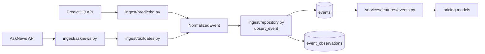

# Event extraction

Two sources feed the `events` table. They disagree about almost everything —
what a record is, how trustworthy it is, how often it changes — so they meet at
a single contract rather than talking to the database in their own shapes.



## The contract: `ingest/normalize.py`

Every adapter returns `NormalizedEvent`, which validates on construction —
empty title, end before start, confidence outside 0..1, a latitude that is
really a longitude. An adapter cannot emit a malformed event; it can only fail
to build one.

Identity is `dedupe_key` = normalized title + city slug + local start date.
Category is deliberately excluded: the two sources routinely disagree on it,
and that disagreement must not split one real event into two rows.

Two fields carry how much to trust a record:

- `status` — `ACTIVE` for a confirmed listing, `PROVISIONAL` for a PredictHQ
  *predicted* event or anything extracted from prose, `DELETED`/`CANCELLED`
  once withdrawn upstream.
- `date_precision` — `DAY`, `MONTH`, or `QUARTER`. Coarse dates are recorded
  rather than rounded away, so "summer 2027" is kept as early signal without
  pretending to be a stay-night.

## PredictHQ — structured listings

`fetch_events()` pages the API by `updated.gte` and returns a `FetchResult` of
events plus rejections. Records arrive already dated and geocoded, so the
adapter is mostly field mapping: GeoJSON `[lon, lat]` unpacked in the right
order, UTC timestamps converted to the venue's local night, `state` mapped onto
`EventStatus`.

It asks for `deleted` records explicitly. Without that, an event cancelled
upstream would sit in the demand forecast forever.

Everything it emits is `confidence = 1.0` and `DatePrecision.DAY`.

## AskNews — prose

AskNews indexes **articles, not events**, so every record is an inference: an
article mentions a festival, and we decide whether it pins down a title, a city
we sell rooms in, and a date precise enough to price against. Most do not.
Dropping those is the bulk of the work.

Three stages:

1. **Search** — one query per city, filtered to that city's country.
   Scoping matters: AskNews bills per search, and an unscoped run rejected 188
   of 198 articles on city alone.
2. **Date resolution** (`textdates.py`) — turns "August 28-30, 2026", "opens
   December 1 and runs through January 4" or "Q3 2027" into a span plus the
   precision achieved. Relative forms ("this weekend") are refused outright: a
   wrong date is worse than a missing one.
3. **Extraction** — city match, category, confidence, and a `RejectReason` for
   anything that does not survive. The per-run tally of those reasons is the
   audit trail for what got dropped and why.

One event per article, because `event_observations` is unique on
`(source, source_ref)` and `source_ref` is the article URL.

Everything it emits is `PROVISIONAL`, with confidence capped at 0.95. It never
sets `expected_attendance`, `venue`, or coordinates — an article does not
reliably state them.

## Where they meet: `ingest/repository.py`

`upsert_event(session, event)` is source-agnostic. It resolves identity in a
specific order that matters:

1. By `(source, source_ref)` — has this source seen this record before?
2. Only then by `dedupe_key`.

Backwards would orphan rows: a revised start date changes the `dedupe_key`, so
resolving by key first would strand the original. `_absorb_key_collision`
merges the two when a revision lands on a key another sighting already holds.

Precedence decides who wins a contested field:

```python
_PRECEDENCE = {Source.PREDICTHQ: 2, Source.ASKNEWS: 1}
```

A structured listing outranks prose. AskNews exists to see an event *before*
PredictHQ does, not to outvote it once it arrives.

`events` holds one merged row per real-world occurrence;
`event_observations` keeps each source's raw sighting verbatim, which is what
makes re-runs idempotent and lets a parser bug be fixed and replayed.

## How events reach pricing

`services/features/events.py` turns stored events into the per-night
`expected_attendance` feature. An event contributes only if it is day-precise,
not withdrawn, and carries an attendance estimate; multi-day events spread
evenly across their nights, weighted by confidence.

In practice this means **AskNews events currently contribute nothing to
pricing** — they never carry attendance. They are stored, deduped against
PredictHQ, and wait to be corroborated.

## New files

Paths under `backend/`. Lines are a rough guide to where the weight sits.

### The contract

| File | Lines | Purpose |
| --- | ---: | --- |
| `foresight/ingest/normalize.py` | 254 | `NormalizedEvent`, `dedupe_key`, and the enums every adapter shares. Validates on construction. |

### Adapters

| File | Lines | Purpose |
| --- | ---: | --- |
| `foresight/ingest/predicthq.py` | 162 | Fetches structured listings near a point and maps them to `NormalizedEvent`. No DB writes. |
| `foresight/ingest/asknews.py` | 470 | Searches news per city and infers events from articles. Owns the reject reasons and the per-run report. |
| `foresight/ingest/textdates.py` | 276 | Resolves prose dates ("August 28-30", "Q3 2027") into a span plus the precision achieved. |

### Persistence

| File | Lines | Purpose |
| --- | ---: | --- |
| `foresight/ingest/repository.py` | 204 | `upsert_event` — source-agnostic merge onto `events` plus an append-only `event_observations` row. |
| `.../versions/b7d41e0c9a52_canonical_events_and_observations.py` | 93 | Creates both tables. |
| `.../versions/c3e9a1f4b6d8_observation_status.py` | 42 | Adds `status` to observations, so a withdrawal is attributable to the source that reported it. |

### Consumption

| File | Lines | Purpose |
| --- | ---: | --- |
| `foresight/services/features/events.py` | 125 | Stored events to the per-night `expected_attendance` feature the pricing models read. |

### Entry points

| File | Lines | Purpose |
| --- | ---: | --- |
| `foresight/ingest/run.py` | 240 | The ingest CLI (`python -m foresight.ingest.run`). PredictHQ only today. |
| `scripts/run_asknews.py` | 171 | Runs the AskNews ingest and prints the cleaning report. Replays fixtures by default; `--live` calls the API. |
| `scripts/forecast_events.py` | 123 | Prices upcoming nights using real stored events, to show their price impact. |

### Tests and fixtures

| File | Lines | Purpose |
| --- | ---: | --- |
| `tests/test_normalize.py` | 140 | Identity, idempotency, and the known source gotchas. |
| `tests/test_predicthq.py` | 142 | Field mapping and paging, against a fake HTTP response. |
| `tests/test_asknews.py` | 449 | What survives extraction, what gets dropped and why, and the HTTP client. |
| `tests/test_textdates.py` | 133 | The date formats announcements actually use, and the ones we refuse. |
| `tests/test_repository.py` | 273 | Upsert behaviour against Postgres: revisions, precedence, deletions. |
| `tests/test_event_features.py` | 168 | Attendance spreading, exclusions, and the radius filter. |
| `tests/test_ingest_run.py` | 54 | `--since` parsing and the run report. |
| `tests/fixtures/asknews/run_{1,2,3}.json` | 342 | Three article batches: a first poll, an overlapping re-poll, and a date revision. Hand-built to the documented AskNews schema, not recorded responses. |

## How to test it

### Automated

```bash
just test                         # whole suite, from the repo root
cd backend && uv run pytest -q tests/test_asknews.py tests/test_textdates.py
```

`test_repository.py` and `test_event_features.py` need Postgres; the rest run
offline against fake HTTP responses. Without a database they error rather than
skip, which looks alarming and is not.

### Database

```bash
just db-up                        # docker compose up -d db migrate
```

Beware: if you already run Postgres on your own machine, it binds
`127.0.0.1:5432` and wins over Docker for anything connecting to `localhost`.
`just db-up` then succeeds while the app silently talks to a different
database. Check with `lsof -nP -iTCP:5432 -sTCP:LISTEN` — more than one
listener means you have the clash. Either stop the host server, or use it
directly:

```bash
psql -d postgres -c "CREATE ROLE foresight LOGIN PASSWORD 'foresight';" \
                 -c "CREATE DATABASE foresight_db OWNER foresight;"
cd backend && uv run alembic upgrade head
```

### Console only, no database

```bash
cd backend && uv run python scripts/run_asknews.py --dry-run
```

Prints the cleaning report and every extracted event, and writes nothing. This
is the mode to use while changing extraction: no Postgres needed, and repeated
runs leave no rows behind. Works with `--live` too.

### AskNews, without credentials

```bash
cd backend && uv run python scripts/run_asknews.py
```

Replays the three recorded batches and writes them through the real upsert.
Expect run 1 to be all `new`, run 2 to report `unchanged` for the overlap, and
run 3 to show one `updated` where a festival moved its dates. Running the whole
thing twice should produce `new 0` throughout and no extra rows — that is the
idempotency check.

Pass `--today 2026-10-06` to pin the reference date; the fixtures are dated
against it and will start ageing out of the horizon eventually.

### AskNews, live

Needs `ASKNEWS_CLIENT_ID` and `ASKNEWS_CLIENT_SECRET` in the repo-root `.env`
(OAuth2 client credentials from the AskNews console, not an API key).

```bash
cd backend && uv run python scripts/run_asknews.py --live --runs 1
```

Use `--runs 1`. AskNews bills per search and the default of 3 would fire the
same queries three times at the same window.

### PredictHQ

Needs `PREDICTHQ_TOKEN`.

```bash
cd backend && uv run python -m foresight.ingest.run \
    --source predicthq --since 7d --city Dublin \
    --lat 53.3498 --lon -6.2603 --report --dry-run
```

`--dry-run` fetches and prints without writing. With `--lat/--lon/--city` it
needs no database at all, and skips the automatic migration too. Drop the flag
to persist. (`--hotel-id` still needs the database, to look the hotel up.)

### Checking what landed

```bash
psql -U foresight -h localhost -d foresight_db -c \
  "SELECT start_local_date, city_slug, date_precision, status, primary_source, title
     FROM events ORDER BY start_local_date;"
```

`event_observations` should hold one row per source sighting, and re-running an
ingest must not grow it.

## Not wired yet

- `run.py` hard-codes `--source predicthq`; AskNews runs through
  `scripts/run_asknews.py` instead.
- Rejected articles are counted, not persisted. There is no quarantine table to
  review them later.
- `confidence` scores *extraction certainty*, not whether something is a real
  bookable event — a live run scored the entity "midterms" at 0.95. It is not
  safe as a quality filter. This matters most for the attendance weighting
  above: if AskNews events ever gain an attendance estimate, that multiplier
  would admit junk at near-full weight.
